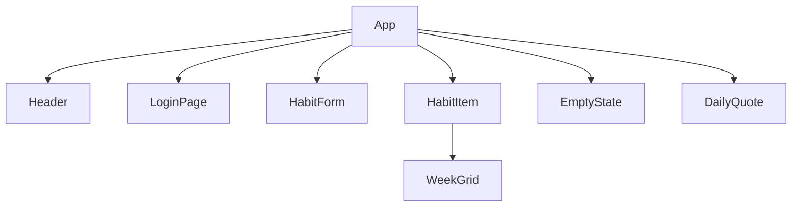

# Architecture

> 15 files in project

## File Structure

```
src/
  ├─ App.tsx
  components/
    ├─ DailyQuote.tsx
    ├─ EmptyState.tsx
    ├─ HabitForm.tsx
    ├─ HabitItem.tsx
    ├─ Header.tsx
    ├─ LoginPage.tsx
    └─ WeekGrid.tsx
  hooks/
    ├─ useAuth.ts
    ├─ useCompletions.ts
    └─ useHabits.ts
  types/
    └─ index.ts
  utils/
    ├─ date.ts
    ├─ quotes.ts
    └─ streaks.ts
```

## Tech Stack

- React 18 + TypeScript
- Tailwind CSS (CDN)
- @vibexe/sdk (data persistence + auth)

## Component Dependencies


