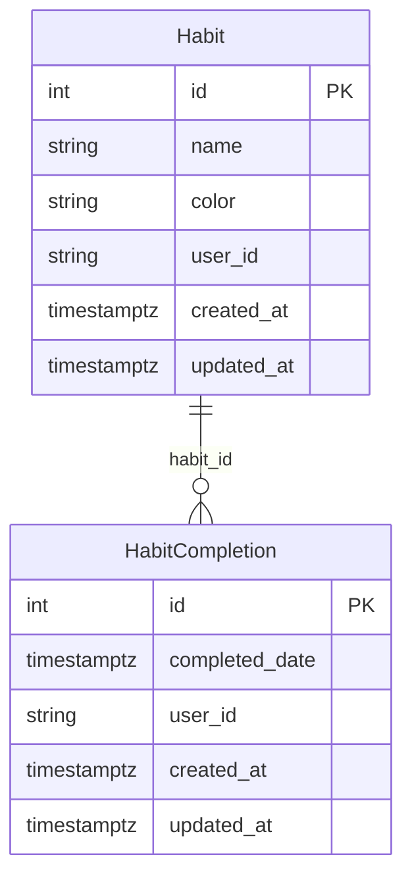

# Data Model

> Schema version 1 · 2 entities

## Habit (`habits`)

| Field | Type | Required | Description |
|-------|------|----------|-------------|
| id | serial | yes | Auto-generated primary key |
| created_at | timestamptz | yes | Row creation timestamp |
| updated_at | timestamptz | yes | Last update timestamp |
| name | text | yes | — |
| color | text | no | — |
| user_id | text | yes | — |

## HabitCompletion (`habit_completions`)

| Field | Type | Required | Description |
|-------|------|----------|-------------|
| id | serial | yes | Auto-generated primary key |
| created_at | timestamptz | yes | Row creation timestamp |
| updated_at | timestamptz | yes | Last update timestamp |
| habit_id | relation | yes | FK → Habit |
| completed_date | date | yes | — |
| user_id | text | yes | — |

## Relationships

- **Habit** → **HabitCompletion** via `habit_id`

## ER Diagram

